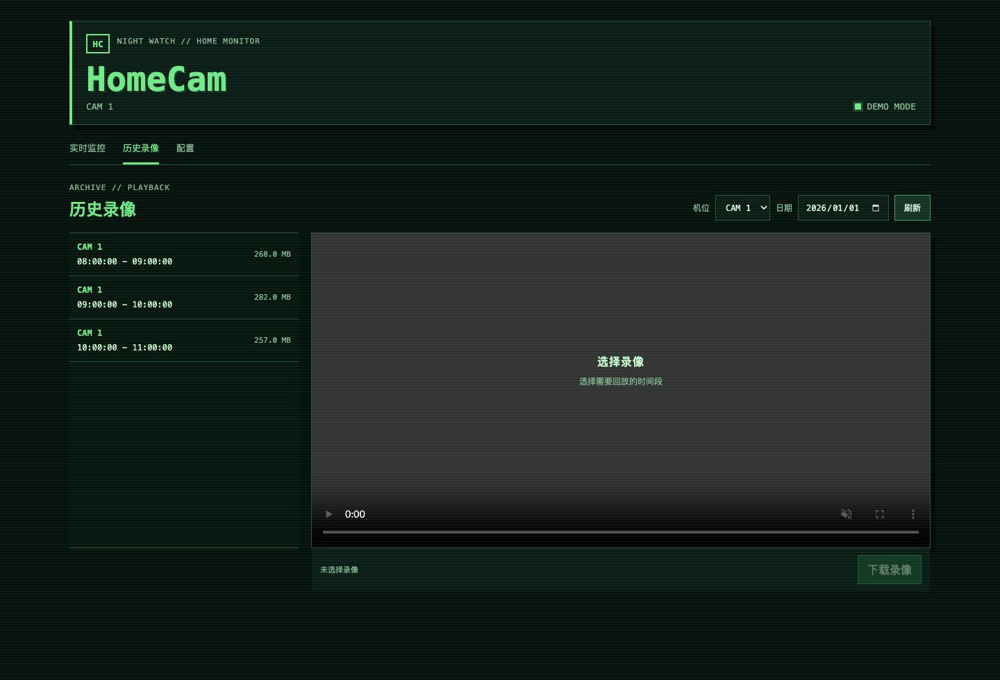

# HomeCam

**Your camera. Your NAS. Your footage.**

HomeCam turns a Raspberry Pi USB camera and a Docker-capable NAS or Linux
server into a private, self-hosted video station. Watch live, revisit
recordings, and tune capture settings from one browser dashboard. No cloud
account or subscription is required to run it.

`USB CAMERA` → `PI / FFMPEG` → `RTSP` → `NAS / MEDIAMTX` → `BROWSER`

[](https://github.com/SimonL777/HomeCam/actions/workflows/ci.yml)
[Quick start](#server-setup) · [Architecture](#architecture) · [Security](#security-boundary)


*Live-view UI preview. The color bars are a synthetic test signal, not camera footage.*

## Why HomeCam

- **Keep the recording where you own it.** MediaMTX writes fMP4 files directly
  to server storage; the Pi does not need a recording disk.
- **Go live or go back.** WebRTC serves low-latency local viewing, same-origin
  HLS handles reverse-proxy access, and historical recordings get a seekable
  HLS playback timeline without changing the original MP4.
- **Keep the stack small.** FFmpeg and systemd on the Pi, MediaMTX and a
  dependency-light Node.js dashboard on the server. The optional controller
  applies camera profiles from the UI.

## Interface

The screenshots below use fictional recording metadata and no private video.
They show the actual frontend with browser-only demo data, not a live camera
or a verified playback session.

| Recording browser | Capture and retention settings |
|---|---|
| [](docs/screenshots/history-demo.png) | [](docs/screenshots/settings-demo.png) |

## Security boundary

> [!WARNING]
> HomeCam handles private video. It authenticates the web dashboard and RTSP
> publisher, but it does not terminate TLS. Keep it on a trusted LAN or VPN, or
> place the dashboard behind an HTTPS reverse proxy. Do not expose its ports
> directly to the public internet.

## Architecture

```text
USB camera
  -> Raspberry Pi / FFmpeg / systemd
  -> authenticated RTSP over the home network
  -> MediaMTX on a NAS or Linux server
     -> fMP4 recordings on server storage
     -> WebRTC UDP for low-latency live view
     -> internal HLS for remote/reverse-proxy playback
  -> HomeCam web dashboard
```

See [PROJECT.md](./PROJECT.md) for the component and security boundaries.

## Requirements

Server:

- Docker Engine with Docker Compose v2.
- A writable location for recordings and settings.
- An IP address reachable by the Raspberry Pi and viewing devices.

Raspberry Pi:

- Raspberry Pi OS or another systemd-based Debian derivative.
- FFmpeg and `v4l2-ctl` (installed by `pi/install.sh`).
- A V4L2-compatible USB camera.

## Server setup

Create the local configuration and replace every `replace-with-*` value:

```bash
cp .env.example .env
# Run this once for each password or secret in .env.
openssl rand -hex 32
nano .env
mkdir -p data/recordings data/config
docker compose config
docker compose up -d --build
docker compose logs -f
```

Open `http://SERVER_IP:8095` and enter the `WEB_USERNAME` and `WEB_PASSWORD`
from `.env`. Change `WEB_PORT` if another service already uses port `8095`.

The default Compose file exposes only:

- `8095/tcp`: authenticated HomeCam dashboard.
- `8554/tcp`: authenticated RTSP ingest and optional RTSP clients.
- `8189/udp`: WebRTC media transport.

MediaMTX HLS and WHEP HTTP endpoints remain inside the Compose network and are
proxied by the authenticated web application.

## Raspberry Pi publisher

Inspect the connected camera first:

```bash
v4l2-ctl --list-devices
v4l2-ctl --device=/dev/video0 --list-formats-ext
```

Install the publisher:

```bash
chmod +x pi/install.sh
sudo ./pi/install.sh
sudo nano /etc/homecam/camera.env
sudo systemctl restart homecam-camera
systemctl status homecam-camera
```

Set `MEDIA_SERVER` to the server IP. Set `MEDIA_USER` and `MEDIA_PASSWORD` to
the same values as `RTSP_PUBLISH_USER` and `RTSP_PUBLISH_PASSWORD` in the
server `.env`. Use an alphanumeric or hexadecimal password so it is safe in an
RTSP URL.

The default capture profile is MJPEG `1280x720` at 15 FPS. If the camera does
not support MJPEG, update the systemd command to use a format reported by
`v4l2-ctl`.

## Optional camera controller

The controller lets the dashboard change resolution, FPS, and bitrate on the
publisher. Restrict it to the server IP during installation:

```bash
chmod +x pi/install-control.sh
sudo HOMECAM_ALLOWED_HOST=SERVER_IP ./pi/install-control.sh
```

Copy the printed token into the server `.env` as `PI_CONTROL_TOKEN`, set
`PI_CONTROL_URL=http://PI_IP:9110`, and recreate the web service. The token is
shown only when first generated and is stored in `/etc/homecam/control.env`.

## Recordings and playback

Original recordings are stored under `data/recordings` and mounted read-only
in the web container. Historical playback uses FFmpeg stream-copy to create
temporary six-second HLS fragments without modifying the source MP4.

The cache lives at `/tmp/homecam-vod` inside the web container, has a 3 GiB
budget, and removes idle jobs after 30 minutes. Restarting the web container
clears only this cache.

## Tests

FFmpeg and FFprobe are required for the recording tests:

```bash
cd app
npm test
```

Additional local checks:

```bash
bash -n pi/install.sh pi/install-control.sh scripts/check-stack.sh
PYTHONPYCACHEPREFIX=/tmp/homecam-pycache python3 -m py_compile pi/homecam-control.py
docker compose config
```

## Current limits

- One configured publishing path by default: `camera-01`.
- No motion detection, notifications, or cloud storage.
- TLS must be provided by a VPN or reverse proxy.
- A network or server outage creates a recording gap; the Raspberry Pi does
  not keep a local recording buffer.

## Contributing and security

See [CONTRIBUTING.md](./CONTRIBUTING.md) before submitting a change. Report
security issues using the private process in [SECURITY.md](./SECURITY.md).

HomeCam is licensed under the [Apache License 2.0](./LICENSE). Third-party
components are listed in [THIRD_PARTY_NOTICES.md](./THIRD_PARTY_NOTICES.md).
