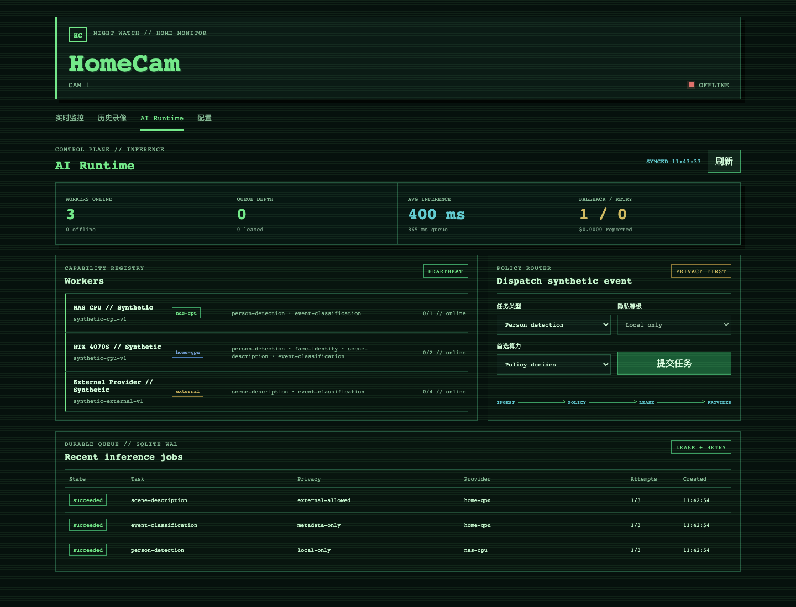
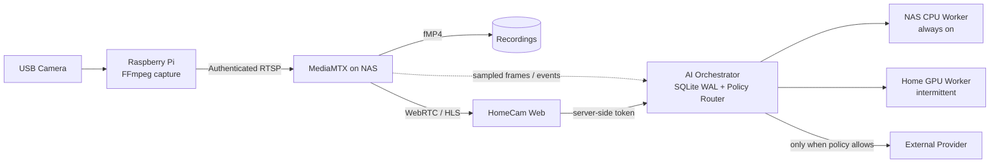
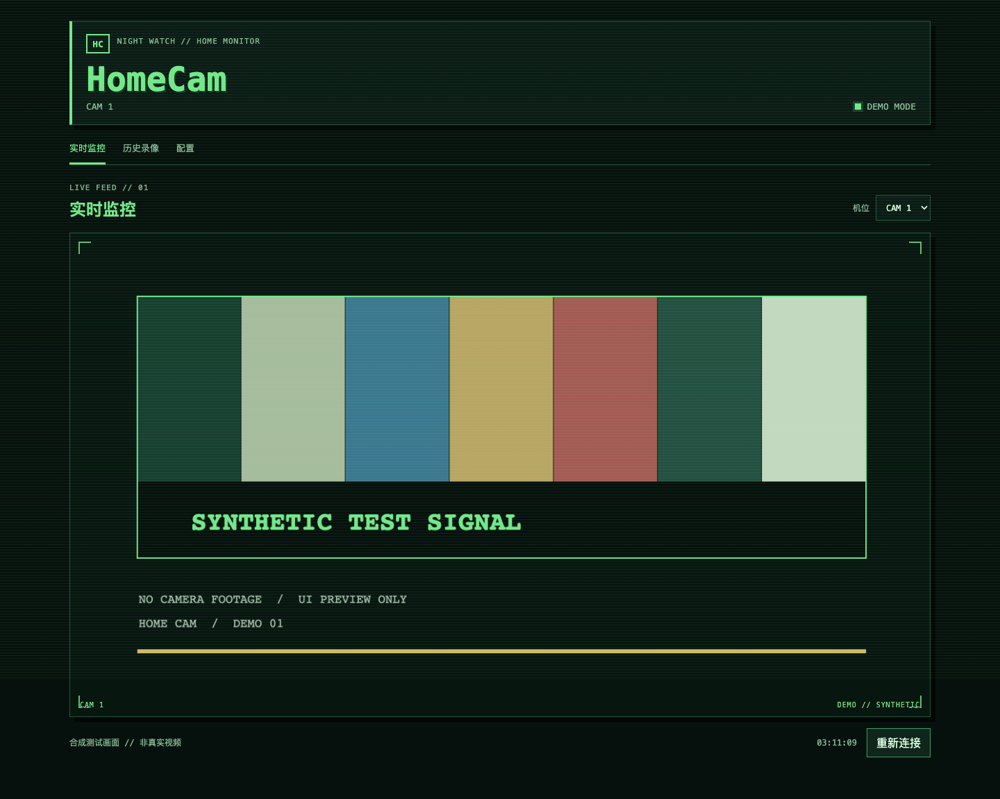
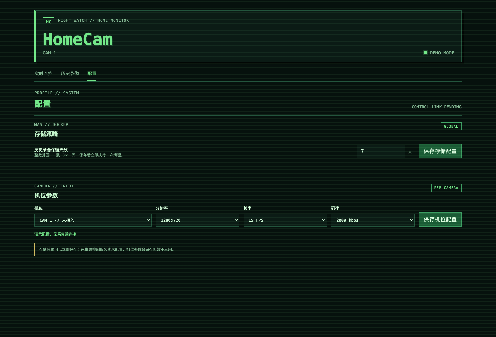

# HomeCam AI

**Private video. Heterogeneous inference. One control plane.**

HomeCam AI is a self-hosted video platform and a runnable AI infrastructure
lab for edge devices, an always-on NAS, intermittent home GPUs, and optional
external model providers.

The Raspberry Pi stays focused on capture. MediaMTX owns transport and
recording. A separate AI control plane owns durable jobs, worker discovery,
policy routing, leases, retries, fallback, cost tracking, and privacy rules.

[](https://github.com/SimonL777/HomeCam/actions/workflows/ci.yml)
[Quick start](#quick-start) · [Run the failover demo](#run-the-failover-demo) · [AI architecture](docs/architecture/ai-runtime.md) · [Security](#security-boundary)



*The UI and all repository screenshots use synthetic data. No private camera
frames, addresses, tokens, or household metadata are included.*

## Why this is AI infrastructure

HomeCam AI treats models and compute as replaceable providers behind a control
plane instead of embedding inference in the web server.

- **Durable inference queue:** SQLite WAL persists jobs, attempts, results, and
  lease state across process restarts.
- **Ephemeral worker lifecycle:** workers register capabilities, report model
  versions and memory, send heartbeats, and become offline automatically.
- **Lease-based execution:** only the current lease owner can complete a job;
  abandoned work returns to the queue with exponential retry delay.
- **Policy routing:** provider choice considers task support, privacy level,
  preferred compute, online capacity, deadline, latency, and budget.
- **Privacy as code:** face identity and raw person detection cannot route to an
  external provider. Tests enforce the rule at both job and worker boundaries.
- **Observable decisions:** queue time, inference latency, provider class,
  model version, attempts, fallback, and reported cost are exposed as JSON and
  Prometheus metrics.
- **Idempotent ingestion:** an `Idempotency-Key` prevents duplicate event jobs
  without silently accepting a different request body.

## Topology



The media plane and AI control plane are independent. `app/server.js` remains
the authenticated video gateway; it does not load models or execute inference.

## Privacy routing

| Task | NAS CPU | Home GPU | External |
|---|---:|---:|---:|
| Person detection | Yes | Yes | **Blocked** |
| Face identity | Yes | Yes | **Blocked** |
| Scene description | Supported | Preferred | Opt-in only |
| Metadata event classification | Yes | Yes | Opt-in / metadata only |

External routing requires both a task policy that allows it and a compatible
privacy level. A preferred provider is a hint, never a policy bypass.

## Run the failover demo

Node.js 22.13 or later and `curl` are enough. No camera, Docker, GPU, model, or
external API token is required.

```bash
cd services/ai-orchestrator
npm run demo:failover
```

The deterministic scenario:

1. Registers a synthetic RTX 4070S worker and external provider.
2. Queues an external-allowed scene-description job with GPU preference.
3. Lets the GPU claim the job and disappear without completing the lease.
4. Recovers the abandoned job and routes attempt two to the external provider.
5. Proves that an external face-identity request is rejected with HTTP 422.
6. Prints the final job state and queue, retry, fallback, latency, and cost metrics.

## Quick start

Create local configuration and replace every `replace-with-*` value:

```bash
cp .env.example .env
openssl rand -hex 32
nano .env
mkdir -p data/recordings data/config data/ai
docker compose config
docker compose up -d --build
docker compose logs -f
```

Open `http://SERVER_IP:8095` and authenticate with `WEB_USERNAME` and
`WEB_PASSWORD`. The default stack starts:

- MediaMTX for authenticated RTSP, recording, WebRTC, and HLS;
- the HomeCam web dashboard;
- the AI orchestrator with persistent SQLite storage.

Start the optional synthetic NAS, GPU, and external providers:

```bash
docker compose --profile ai-demo up -d --build
cd services/ai-orchestrator
AI_ORCHESTRATOR_TOKEN="$(sed -n 's/^AI_ORCHESTRATOR_TOKEN=//p' ../../.env)" npm run demo
```

The AI API binds to `127.0.0.1:8090` by default. To connect a worker from a
different machine, bind it to a trusted LAN or VPN address with
`AI_BIND_ADDRESS`, then restrict that port with a firewall. Never expose it
directly to the internet.

## Raspberry Pi publisher

Inspect the connected camera:

```bash
v4l2-ctl --list-devices
v4l2-ctl --device=/dev/video0 --list-formats-ext
```

Install the publisher:

```bash
chmod +x pi/install.sh
sudo ./pi/install.sh
sudo nano /etc/homecam/camera.env
sudo systemctl restart homecam-camera
systemctl status homecam-camera
```

Set `MEDIA_SERVER`, `MEDIA_USER`, and `MEDIA_PASSWORD` to the server and the
matching `RTSP_PUBLISH_*` values. The optional `pi/install-control.sh` service
allows validated capture profile changes from the dashboard.

## Interfaces

| Live and recordings | Capture and retention |
|---|---|
| [](docs/screenshots/dashboard-demo.png) | [](docs/screenshots/settings-demo.png) |
| [Recording browser](docs/screenshots/history-demo.png) | [AI Runtime](docs/screenshots/ai-runtime-demo.png) |

## What is implemented

- Raspberry Pi FFmpeg capture and authenticated RTSP publishing.
- MediaMTX live distribution and fMP4 recording.
- Authenticated live view, recording browser, seekable HLS VOD, downloads, and
  camera settings.
- Independent AI orchestrator API and SQLite-backed queue.
- Worker registration, capability discovery, heartbeat, liveness, leases,
  retry, dead-letter state, fallback, deadline, and budget routing.
- JSON overview and Prometheus metrics.
- Synthetic providers, a generic Bearer-auth HTTP JSON provider adapter, and a
  browser control-plane view.

## What is deliberately not claimed

- The included workers return deterministic synthetic results; they do not run
  YOLO, face embeddings, a VLM, or a hosted model API.
- The media-to-event sampler and a production alert channel are not included.
- External providers are disabled by default. The generic HTTP JSON adapter is
  not a vendor-specific or production-certified integration, and HomeCam never
  uploads recordings or frames without an external-allowed job.
- Reported provider cost comes from worker metadata; it is not a billing source
  of truth.

These boundaries keep the infrastructure demonstrable without presenting a
mock model as production AI. See [AI Runtime Architecture](docs/architecture/ai-runtime.md)
for the provider contract and next implementation steps.

## Security boundary

> [!WARNING]
> HomeCam handles private video. Use it on a trusted LAN or VPN, or behind an
> authenticated HTTPS reverse proxy. The project does not terminate TLS. Do
> not expose dashboard, RTSP, Pi control, or AI control-plane ports directly to
> the public internet.

- Dashboard users and RTSP publishers use separate credentials.
- The browser never receives the MediaMTX or AI internal bearer tokens.
- Recording files are read-only inside the web container.
- AI provider access is deny-by-policy for identity and raw person detection.
- Example data and screenshots are synthetic.

See [SECURITY.md](SECURITY.md) and [PROJECT.md](PROJECT.md) for the complete
trust boundary.

## Tests

```bash
cd app && npm test && npm run check
cd ../services/ai-orchestrator && npm test && npm run check
```

The CI workflow also checks shell and Python syntax, validates Docker Compose,
and validates the pinned MediaMTX configuration.

HomeCam is licensed under the [Apache License 2.0](LICENSE). Third-party
components are listed in [THIRD_PARTY_NOTICES.md](THIRD_PARTY_NOTICES.md).
